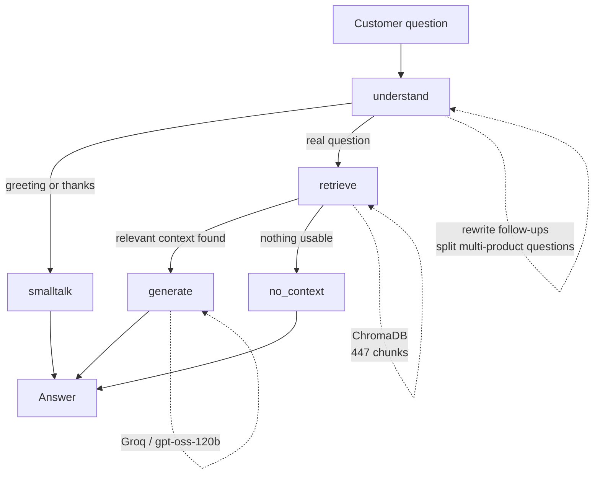

# e& Egypt Knowledge-Base Chatbot

A bilingual (Arabic/English) retrieval-augmented chatbot that answers questions
about e& Egypt mobile packages, internet plans, prices and service codes,
grounded entirely in the company's official documentation.

Built for the **e& Summer Internship Program** by Ahmed Khairy.

---

## What it does

Ask a question in Arabic, English, or a mix of both. The system retrieves the
relevant passages from the knowledge base and answers from them, citing which
source each figure came from. If the documentation does not cover the question,
it says so rather than guessing.

```
> How much does Emerald 430 cost per month?
The Emerald 430 package costs 430 EGP per month before taxes [1].

> عايز اعرف سعر باقة حكاية 46
سعر باقة حكاية انترنت 46 هو 46 جنيه [1].
(ميني حكاية انترنت 46 بصلاحية 3 أسابيع سعرها 46 جنيه أيضاً [2].)

> ايه تفاصيلها
حكاية إنترنت 46 هي باقة شهرية، تفاصيلها كالتالي:
· السعر: 46 جنيه
· الإنترنت: 1,250 ميجابايت
· وحدات المكالمات والرسائل: 300 وحدة
...
```

---

## Architecture



The agent is a LangGraph state machine with two conditional edges.

**understand** detects the question's language and prepares the search. Two
optional LLM calls happen here:

- *Query rewriting* — a follow-up like "what are its details" carries no
  product name, so it is rewritten using the last four turns into a question
  that can stand alone.
- *Query decomposition* — a question naming two products is split into one
  search per product.

Both are skipped when they cannot help, to save API calls.

**smalltalk** answers greetings and thank-yous from fixed text, without
touching the knowledge base or the language model.

**retrieve** searches ChromaDB once per prepared query, merges the results,
removes duplicates, and keeps the eight closest chunks.

**generate** builds a prompt from the retrieved passages and calls the model.

**no_context** handles the case where retrieval finds nothing usable at all.

---

## Running it

Requires Python 3.10+ and the knowledge base documents, which are not included
in this repository.

```bash
git clone https://github.com/ahmedkhairysaleh-boop/e--rag-chatbot.git
cd e--rag-chatbot

python -m venv venv
venv\Scripts\activate          # Windows
source venv/bin/activate       # macOS / Linux

pip install -r requirements.txt
```

Place the knowledge base folder in the project root so the structure reads
`e& Knowledge base/` with the Arabic `.docx` files at its top level and the
English `.pdf` files in an `English/` subfolder.

Create a `.env` file:

```
LLM_API_KEY=your-key-here
LLM_BASE_URL=https://api.groq.com/openai/v1
LLM_MODEL=openai/gpt-oss-120b
```

Any OpenAI-compatible provider works — Groq, Google Gemini, Mistral, Cerebras.
Changing provider means changing these three lines and nothing else.

Build the vector database, then start the app:

```bash
python -m scripts.ingest --reset
streamlit run app.py
```

### Other entry points

```bash
python -m scripts.chat                    # terminal chat
python -m scripts.ask "your question"     # inspect what retrieval returns
python -m scripts.evaluate                # run the test set
python -m scripts.evaluate --retrieval-only   # same, without LLM calls
```

---

## Project structure

```
src/
  config.py           settings: paths, model names, chunking and retrieval limits
  language.py         Arabic/English detection
  logging_config.py   console and file logging
  extractors.py       .docx and .pdf to (heading, text) sections
  chunking.py         sections to indexable chunks
  vectorstore.py      ChromaDB: build, search, language filtering
  llm.py              the model client, provider-agnostic
  prompts.py          system prompt, rewriting, decomposition
  graph/
    state.py          what flows between nodes
    nodes.py          understand, smalltalk, retrieve, generate, no_context
    build.py          the state machine

scripts/
  ingest.py           build the vector database
  chat.py             terminal interface
  ask.py              retrieval debugging
  evaluate.py         run the test set, write the report

tests/questions.py    24 bilingual test cases
app.py                Streamlit interface
```

---

## Design decisions

**Structure-aware chunking rather than fixed-size splitting.** The source
documents have real headings — the Arabic `.docx` files carry Word heading
styles, the English PDFs use numbered sections. Splitting there gives chunks
that are already coherent topics. Every chunk is prefixed with its heading
path, because a chunk reading "Monthly price: 430 EGP" loses the package name
that sits in the heading above it, and a search for "Emerald 430 price" would
not match it.